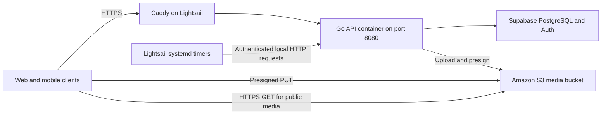

# AWS Lightsail hosting and Amazon S3 migration plan

Status: application changes and deployment files are implemented. AWS resource creation, live acceptance checks, and production cutover remain to be performed. Follow [the deployment guide](AWS_LIGHTSAIL_DEPLOYMENT.md) for the executable setup steps.

## Recommended architecture

Run the Go API in Docker on one Linux Lightsail instance, with Caddy providing HTTPS. Use a standard Amazon S3 bucket directly for media uploads and image delivery. The user confirmed there is no media on R2, so no object copying or existing media URL migration is required. Continue using the existing Supabase PostgreSQL database and authentication services.



Start with a Lightsail instance with approximately 2 GB RAM; choose the final bundle after measuring current memory and CPU use. Choose the region closest to the existing Supabase database to avoid adding latency to every database request; Mumbai is a candidate if the database and users are in India. Place S3 in the same AWS region as Lightsail.

A single instance has downtime during host failures and maintenance. If availability requirements demand automatic failover, plan a second instance and load balancer as a separate step.

## What this repository needs

- `Dockerfile` already builds the Go API and includes the SQL migrations.
- `internal/storage/s3.go` uses AWS SDK for Go v2 with a real AWS region and default credential loading. Initialization checks credentials before connecting to the database.
- `internal/domain/upload/handler.go` provides multipart upload and five-minute presigned PUT URLs. Preserve the endpoint paths and response fields during migration.
- `internal/config/config.go`, `.env.example`, and `cmd/api/main.go` use S3 configuration and client wiring.
- `render.yaml` defines six external cron schedules. The API does not run its scheduler loop internally, so these schedules must be replaced explicitly.
- `/health` reports that the HTTP process is running; `/ready` checks database connectivity and shutdown state.
- Migrations and a ratings backfill run at application startup. A deployment can therefore change the shared database before receiving traffic.

## Phase 1: confirm deployment inputs

Record these inputs before creating resources:

1. AWS account and region, current Supabase database region, API hostname, and S3 bucket name.
2. Expected storage, monthly upload/download volume, and peak API traffic.
3. Confirm that uploaded images are intended to be publicly readable through permanent URLs, as the current API contract expects.
4. Production environment variables, including Supabase, Resend, FCM, Play Integrity, Turnstile, passkey origins, frontend origins, and `CRON_SECRET`.
5. Database backup status and any pending SQL migrations.

Estimate the ongoing cost of the Lightsail instance, snapshots, S3 storage, requests and internet data transfer, and logging using expected traffic.

## Phase 2: configure S3 and media delivery

1. Create a dedicated Amazon S3 bucket for public media with a unique production name. Enable versioning, disable ACLs through Bucket owner enforced ownership, and use default server-side encryption.
2. Add a bucket policy granting anonymous `s3:GetObject` on the intended public media prefixes. Do not grant anonymous list, upload, or delete access. Adjust bucket and effective account Block Public Access policy-blocking settings to permit this public read policy while retaining ACL-blocking settings. Review the account-level setting's scope before changing it. [AWS public access documentation](https://docs.aws.amazon.com/AmazonS3/latest/userguide/granting-public-access.html).
3. Use the regional HTTPS object endpoint as the public URL base: `https://<bucket>.s3.<region>.amazonaws.com`. No media DNS or additional TLS certificate is needed.
4. Configure bucket CORS for the exact frontend origins that upload files, allowing `PUT` and the headers used by the presigned requests. Include `GET`/`HEAD` if clients directly read S3 objects. CORS does not grant object permissions. [AWS S3 CORS documentation](https://docs.aws.amazon.com/AmazonS3/latest/userguide/cors.html).
5. Give the application bucket-scoped `s3:PutObject` and `s3:GetObject` permissions; include `s3:DeleteObject` if retaining the existing delete capability. Match the permitted prefixes to the upload handler's supported prefixes. Do not grant the runtime principal account-wide S3 access.
6. For this Lightsail deployment, provision a dedicated IAM application principal with narrowly scoped access keys, stored in a protected runtime credential file and rotated regularly. The documented credential-free Lightsail instance attachment is for Lightsail buckets; do not assume that attachment grants access to this standard S3 bucket. [Lightsail bucket resource access](https://docs.aws.amazon.com/lightsail/latest/userguide/amazon-lightsail-configuring-bucket-resource-access.html).
7. Define lifecycle retention for old object versions and incomplete multipart uploads after confirming recovery requirements.

Only public media belongs in this bucket. Future private documents need a separate private bucket with temporary signed GET URLs.

## Phase 3: implemented Go storage changes

Keep the existing storage operations and API contract; a provider framework is unnecessary for this migration.

| File | Implemented change |
| --- | --- |
| `internal/storage/s3.go` | Replaces `R2Client` with `S3Client`; uses the real AWS region and SDK default credential chain. Retains upload, delete, GET presigning, PUT presigning, UUID keys, and public URL construction with escaped object paths. |
| `internal/config/config.go` | Replace the R2 fields with S3 bucket, region, and public media URL settings. Validate required storage settings at startup. |
| `internal/domain/upload/handler.go` | Use the S3 client while retaining endpoint paths, response fields, content types, and the five-minute presign expiry. |
| `cmd/api/main.go` | Initialize the S3 client and fail clearly if configuration initialization fails. |
| `go.mod` / `go.sum` | Add the AWS SDK configuration module needed for the default credential chain. |
| `.env.example` | Document S3 settings and standard AWS credential variables without real credentials. |
| `API_DOC.md` and upload Bruno examples | Replace R2 descriptions and upload URL examples with S3 examples. |

Use these environment variables:

```dotenv
AWS_REGION=ap-south-1
S3_BUCKET_NAME=qwish-media-production-<unique-suffix>
# Optional: derived from bucket and region when empty.
S3_PUBLIC_URL=
AWS_ACCESS_KEY_ID=<provided-through-protected-runtime-credentials>
AWS_SECRET_ACCESS_KEY=<provided-through-protected-runtime-credentials>
```

The region above is an example, subject to Phase 1. Let the SDK support `AWS_SESSION_TOKEN` when temporary credentials are supplied.

Browser clients upload to the returned S3 `upload_url` and display the returned S3 `public_url`. Confirm that clients send the expected Content-Type and any required signed headers. Presigned URLs delegate only the permissions of their signing principal. [AWS presigned URL documentation](https://docs.aws.amazon.com/AmazonS3/latest/userguide/using-presigned-url.html).

The current multipart endpoint has a 5 MB limit, but the presigned PUT path does not enforce that same limit. Document this existing difference; strict size enforcement would require a separate upload change, such as a presigned POST policy or validation after upload.

## Phase 4: prepare Lightsail deployment

1. Create a Linux Lightsail instance and attach a static IPv4 address. Point the API hostname to that address at cutover. A static IP prevents DNS changes when the instance is stopped and restarted. [AWS static IP documentation](https://docs.aws.amazon.com/lightsail/latest/userguide/lightsail-create-static-ip.html).
2. Allow public ports 80 and 443; restrict SSH to administrator addresses. Configure IPv4 and IPv6 rules explicitly. Keep API port 8080 bound to loopback and do not expose the database. [AWS Lightsail firewall documentation](https://docs.aws.amazon.com/lightsail/latest/userguide/understanding-firewall-and-port-mappings-in-amazon-lightsail.html).
3. Add a Docker Compose deployment for the API and Caddy, with restart policies, bounded log retention, persistent Caddy certificate storage, and protected environment files. Exclude secrets and `.env` from the Docker build context.
4. Build the image in CI and deploy a versioned tag or digest. Retain the previous image for rollback. Avoid building on the production instance during routine releases.
5. Set `APP_ENV=production`, exact `ALLOWED_ORIGINS`, and all current external service settings. Preserve passkey origins and frontend link URLs. Use a compatible Supabase connection endpoint, preferably the existing session pooler configuration.
6. Size container memory and `GOMEMLIMIT` from the selected host capacity. The existing Render value of `400MiB` was chosen for a 512 MB service and should be reviewed.
7. Graceful shutdown handling and `/ready` database checks are implemented. Keep `/health` as process liveness and use readiness to decide whether to route traffic to a newly deployed API.
8. Configure the reverse proxy for the notification SSE endpoint so events are streamed promptly. Verify streaming behavior through the final HTTPS hostname.
9. Enable instance snapshots, monitor disk and memory, and alert on API unavailability, repeated upload failures, and cron failures. Snapshots do not replace the external Supabase database backup.

Provided deployment files: `deploy/compose.yaml`, `deploy/Caddyfile`, `deploy/deploy.sh`, `deploy/cron/install.sh`, timer units, S3 policy templates, and the deployment guide.

## Phase 5: replace Render cron jobs

Install systemd timers and services on Lightsail. They should invoke the existing API endpoints through loopback with `X-Cron-Secret`, store logs in the journal, report failures, and prevent overlapping executions of the same job. Use UTC explicitly and preserve chain ordering.

| Schedule in UTC | Endpoints under `/api/v1/internal/cron/`, in order |
| --- | --- |
| Hourly at minute 0 | `close-expired-quizzes`, `abandon-stale-attempts`, `assignment-reminders`, `teacher-notifications` |
| Daily at 00:00 | `expire-points`, `reset-streaks`, `rank-change-alerts`, `recompute-question-difficulty`, `purge-onboarding-sessions`, `purge-attempt-behavior`, `end-inactive-enrollments` |
| Daily at 14:00 | `streak-nudges` |
| Every five minutes | `dispatch-announcements` |
| Monday at 00:01 | `snapshot-leaderboard` |
| Monday at 08:00 | `weekly-digests`, `weekly-insights-email` |

Preserve the existing 900-second HTTP job allowance and ensure long job requests reach the API without proxy timeouts. Use persistent timers to trigger a missed scheduled activation after downtime; this does not replay every missed interval. Review each job's behavior before enabling retries, since a retry can duplicate side effects unless the job is idempotent.

Exactly one deployment must own production schedules during cutover. Keep the Lightsail timers disabled until the Render cron jobs have been disabled. The existing GitHub cron workflow now requires the `ENABLE_GITHUB_CRON` repository variable to be `true` for scheduled runs; keep it unset or false on Lightsail.

## Phase 6: validate and cut over

Deploy initially under a temporary API hostname with production schedules disabled. Use a staging database for destructive validation; inspect pending migrations before allowing the new API to boot against production.

Acceptance checks:

- HTTPS, CORS, sign-in, token refresh, and a representative quiz flow work.
- Multipart upload returns a working media URL.
- A browser performs a presigned PUT to S3 and reads the resulting image through the permanent S3 HTTPS URL.
- Expired signatures and unauthorized uploads fail; anonymous reads work only for intended public media objects, and anonymous writes, deletes, and listing remain denied.
- Notification streaming works through the reverse proxy.
- Each schedule has been checked safely, ordering is preserved, and failed executions are visible.
- Restarting the API and rebooting the host recover the service and timer configuration.

Cutover order:

1. Confirm database backup and migration compatibility, lower DNS TTL in advance, and retain the previous deployment image.
2. Deploy the S3-configured API and complete the upload checks before switching traffic.
3. Activate the S3-configured API on Lightsail and switch the API hostname to the static IP.
4. Disable Render production schedules, then enable Lightsail timers.
5. Monitor API errors, latency, image failures, and scheduled jobs.
6. Retain the previous hosting deployment through an agreed observation period before retiring it. Remove unused R2 credentials after confirming production uses S3.

## Rollback

- Application rollback: deploy the previous compatible S3-enabled image or point the API hostname back to a Render deployment prepared with the S3 changes and settings. The original R2-only binary cannot write to the standard S3 bucket without those changes.
- Storage recovery: retain the S3 bucket and uploaded objects across application rollbacks. Use S3 versions for object recovery where necessary; no R2 copy or media DNS rollback is required.
- Schedule rollback: disable Lightsail timers before re-enabling Render cron jobs.
- Database rollback: an older binary must be compatible with migrations applied by the new deployment. Image or DNS rollback does not undo schema changes; use a reviewed database recovery procedure if needed.

The implementation is complete when the API serves production traffic from Lightsail, both upload paths write to S3, returned S3 image URLs resolve, and all six schedules run under their new owner with observable failures.
